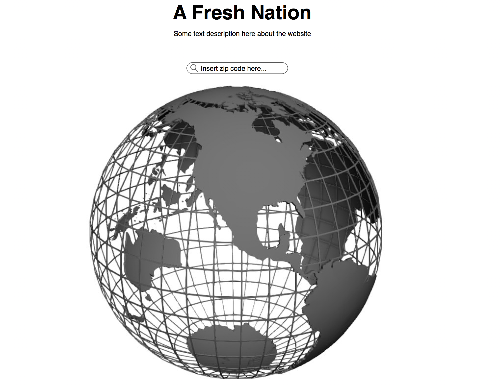
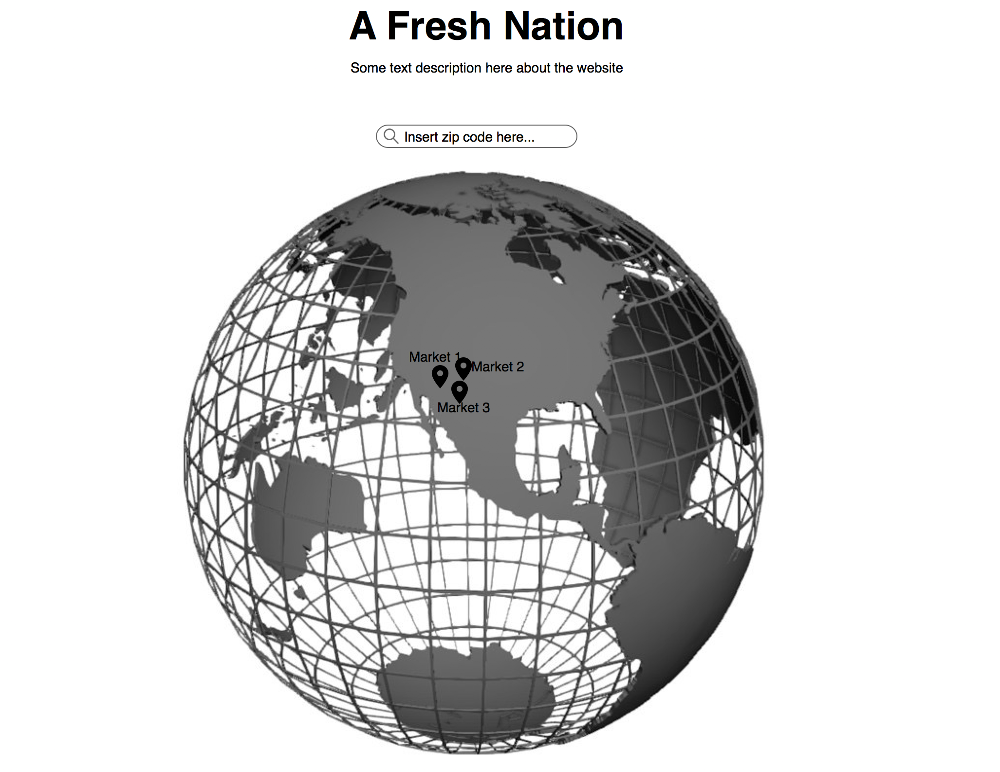
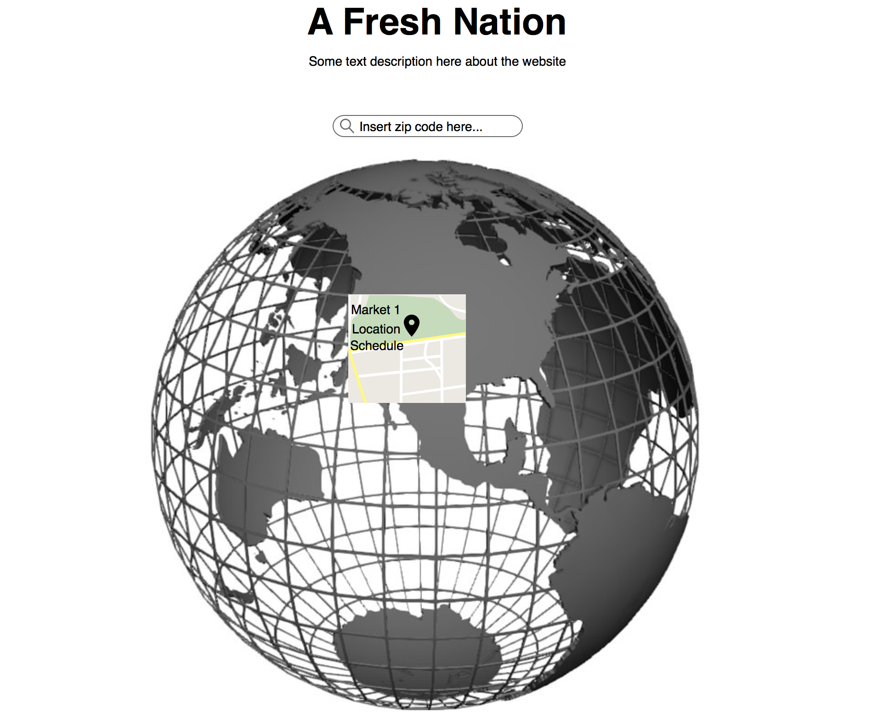

# A-Fresh-Nation

This website uses the USDA National Farmers Market Directory API to retrieve a markets address, schedule, and products (if available) based on a users zip code. When a user enters there zip code into the search bar all the farmers market in that area will populate the globe. To get more information about a specific market, click on that market.

## Wireframes

#### Homepage

#### Zip code view

#### Individual market view

## Technologies used
### -react
### -react-simple-maps
### -USDA farmer's market API (https://search.ams.usda.gov/farmersmarkets/v1/svcdesc.html)

